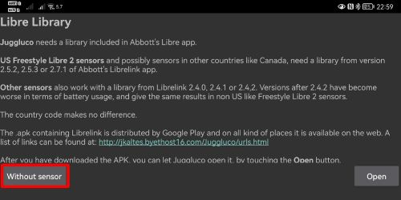
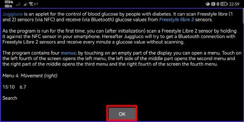
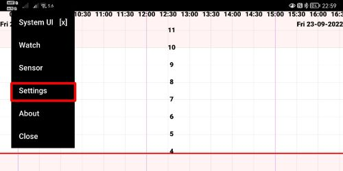

# Freestyle Libre 3 instructions

The Freestyle Libre 3 system can automatically report dangerous blood glucose levels. The Libre3 Sensor sends the current blood sugar level to a receiver (reader or smartphone) every minute. The receiver triggers an alarm if necessary. With a modified LibreLink app, Juggluco app and the xDrip+ app, you can continuously receive and display your blood sugar level on your smartphone. It's even possible to receives older data out of the sensor memory (two hours minutely glucose and two weeks once per 5 minute history data.) This is sendt to Juggluco.

The sensor can be calibrated in the range of -40 mg/dl to +20 mg/dl (-2,2 mmol/l to +1,1 mmol/l) to adjust differences between finger prick measurements and sensor readings.

### Current limitations

- It's currently not confirmed if this solution is working with US version of the Freestyle Libre 3 sensors!
- The app will only work for arm64 systems (64 bit systems). Most modern phones are supported. If you are unsure, just try to install the patch and try to start the app.
- If you have a rooted system, you need to cover the root. Here you got some instructions: [link](https://www.reddit.com/r/Freestylelibre/comments/s22vlr/comment/hw2p4th/?utm_source=share&utm_medium=web2x&context=3).
- Juggluco (required app to receive the libre3 readings) does only support English, Dutch and Italian languages. The patched Libre3 app does support: ar, de, es, fr, hi, in, it, ja, ko, my, nl, pt, ru, th, tr and vi.

## Step 1: Download and setup the patched LibreLink-App

Download the patched .apk file [here](https://github.com/maheini/FreeStyle-Libre-3-patch/raw/main/Patched%20Apk/Libre%203_v3.3.0_apkfab.com.apk) or [here](https://apkfab.com/libre-3/com.freestylelibre3.app.de/apk?h=142cfbb2e0b1f10cd280408b10c5a5127e46e00e78d7775dae382529921487e9) and install it on your phone.

After you successfully installed the app on your phone, open the app. If you see any warning like the one below, you can ignore it. (The app is working with any EU sensor).

If you are on the screen "Create an Account", you got the option to create a LibreView account. This might be a good option, as you got the possibility to re-enable a sensor with a different  app. It also allows you to share the BG data to LibreView. I you don't like to, just press "Skip" at the top right.

Plese select your Unit of Messurement on this screen. You can change it later as well.

If you got a Popup, asking for "Ignore battery optimisation?", click "ALLOW". This will keep the Libre3 app running in the background.

Now you should have set up the Libre3 app. Let's continue with the connection to Juggluco

## Step 2: Connect Libre3 with Juggluco

Open the Libre3 sidebar and select Juggluco.

Within the Juggluco menu, ensure "Port" is set to 7117 and click "Add Connection" on the bottom.

Now, fill in everything, according to the image below:

It you are done, click on "Save" to confirm your setttings. Awesome, you can close the Libre3 app now!

## Step 3: Setup Juggluco

Download and install [Juggluco app from GooglePlay](https://play.google.com/store/apps/details?id=tk.glucodata&pcampaignid=pcampaignidMKT-Other-global-all-co-prtnr-py-PartBadge-Mar2515-1).

Now let's open the app. You will be greeted with this screen below. Just click the "Without sensor" button.

After that, you get a short introduction text. Click on "OK".

Ok, let's setup Juggluco! The app itself doesn't have the best Interface, but it's a very useful app. To open the settings, click anywhere on the top left screen. Now you should see this menu below. Select "Settings".

Within the settings, you can configure the data-connection to xDrip. Click on "Send to xDrip" and press "OK".

Press on the top left center within the Juggluco app. A new menu should pop up. Please select "Mirror".

You should see this screen. Please check the port settings on the top right corner, which should be set to "8795" and after that, tap on "Add Connection". (Keep in mind, within the Juggluco app the ports are switched)

Now let's fill in all the settings as shown below and your password according to your Libre3 password. If you did that - press "Save" to confirm.

Well done! You can now try to press the "Sync" button within the previous menu. After some time, Juggluco should receive the blood glucose values automatically from Libre3 app.

Now start the Libre3 sensor with the patched app by simply scanning the sensor. Ensure to have set all settings done. You can use a sensor that was already used with the original Libre3 app if you specify the same LibreView account name. You have to press "Start New Sensor" and scan the sensor. If you want to go back to the unpatched Libre 3 app, you have to do the same.

Mandatory settings for successful sensor start:

- NFC enabled / BT enabled
- memory and location permission enabled
- location service enabled
- automatic time and time zone setting
- set at least one alarm in the patched app

Please note that the location service is a central setting. This is not the app location permission which has to be set also!

## Step 4 (optional): Set up xDrip

The blood sugar values are received on the smartphone by the xDrip+ App.

- If not already set up then download xDrip+ app and install one of the latest nightly builds from [here](https://github.com/NightscoutFoundation/xDrip/releases).
- In xDrip+ select "Libre2 (patched App)" as data source
- If necessary, enter "BgReading:d,xdrip libre_receiver:v" under Less Common Settings->Extra Logging Settings->Extra tags for logging. This will log additional error messages for trouble shooting.
- In xDrip+ go to Settings -> Interapp Compatibility -> Broadcast Data Locally and select ON.
- In xDrip+ go to Settings -> Interapp Compatibility -> Accept Treatments and select OFF.
- to enable AAPS to receive blood sugar levels (version 2.5.x and later) from xDrip+ please set Settings -> Interapp Settings -> Identify Receiver "info.nightscout.androidaps".
- If you want to be able to use AndroidAPS to calibrate then in xDrip+ go to Settings -> Interapp Compatibility -> Accept Calibrations and select ON. You may also want to review the options in Settings -> Less Common Settings -> Advanced Calibration Settings.

## Step 5 (optional): Start sensor within xDrip

In xDrip+ start the sensor with "Start Sensor" and "not today".

In fact this will not physically start any Libre2 sensor or interact with them in any case. This is simply to indicate xDrip+ that a new sensor is delivering blood sugar levels. If available, enter two bloody measured values for the initial calibration. Now the blood glucose values should be displayed in xDrip+ every 5 minutes. Skipped values, e.g. because you were too far away from your phone, will not be backfilled.

After a sensor change xDrip+ will automatically detect the new sensor and will delete all calibration data. You may check you bloody BG after activation and make a new initial calibration.

## Step 6 (for looping only): Configure AndroidAPS (for looping only)

- In AndroidAPS go to Config Builder -> BG Source and check "xDrip+"
- If AndroidAPS does not receive BG values when phone is in airplane mode, use "Identify receiver"

Until now, using Libre 2 as BG source you cannot activate 'Enable SMB always' and 'Enable SMB after carbs' within SMB algorithm. The BG values of Libre 2 are not smooth enough to use it safely.

## Experiences and Troubleshooting

### Troubleshooting Libre3 no readings

- Android location service is not granted - please enable it in the system settings
- automatic time and time zone not set - please change the settings accordingly
- Bluetooth is switched off - please switch on

### Troubleshooting Libre3 -> Juggluco connection

- Ensure if Libre3 is receiving any readings
- Check your settings & password again
- Click "Sync" within Libre3->Juggluco and "Sync" and "Reinit" button within Juggluco->Mirror
- It is possible that sometimes after configuring everything, you have to force close Libre3 and restart it.
- Wait some time or try to force close Juggluco
- Older versions of Juggluco (below 2.9.6) will not send back-filled data from the Libre3 sensor to connected devices (for example Juggluco on WearOS.) It is possible that you have to press "Resend Data" on within the patched Libre 3 app (Juggluco menu) for this.

### Further help

Original instructions: [jkaltes website](http://jkaltes.byethost16.com/Juggluco/libre3/)

Additional Github repo: [Github link](https://github.com/maheini/FreeStyle-Libre-3-patch)
