# Freestyle Libre 3 Anleitung

## Informationen

Das Freestyle Libre 3 System kann automatisch gefährliche Blutzuckerwerte melden. Der Libre3 Sensor sendet jede Minute den aktuellen Blutzuckerwert an einen Empfänger (Lesegerät oder Smartphone). Der Empfänger löst bei Bedarf einen Alarm aus. Mit Hilfe der Juggluco App kann der Sensor nach dem Start übernommen werden und mit Xdrip+, AndroidAPS oder Libreview verbunden werden. So können die Blutzuckerwerte direkt übertragen werden. Es ist sogar möglich, ältere Daten aus dem Speicher des Sensors zu empfangen (zwei Stunden minütliche Glukose und zwei Wochen einmal pro 5 Minuten Verlaufsdaten), die an Juggluco gesendet werden.

Der Sensor kann im Bereich von -40 mg/dl bis +20 mg/dl (-2,2 mmol/l bis +1,1 mmol/l) kalibriert werden, um Unterschiede zwischen der blutigen Messung und den Sensormessungen auszugleichen.

### Derzeitige Einschränkungen

- Wenn du ein gerootetes System hast, musst du diesen verstecken. Hier findest du eine Anleitung: [Link](https://www.reddit.com/r/Freestylelibre/comments/s22vlr/comment/hw2p4th/?utm_source=share\&utm_medium=web2x\&context=3).
  (Um herauszufinden, ob das Smartphone gerootet ist, gibt es mehrere Apps, eine davon ist z.B. [Root Checker App](https://play.google.com/store/apps/details?id=com.joeykrim.rootcheck))
- Die Juggluco App unterstützt nur die Sprachen Englisch, Niederländisch und Italienisch.

## Schritt 1: Herunterladen und Einrichten der Libre3 App

Installiere die Libre 3 App aus dem Playstore und öffne diese. Auf dem Startbildschirm klickst du auf "Anmelden". Die Anmeldung mit deinem Libreview Account ist zwingend notwendig - solltest du keinen haben, kannst du dir einen erstellen.

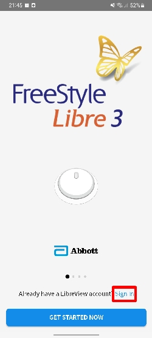 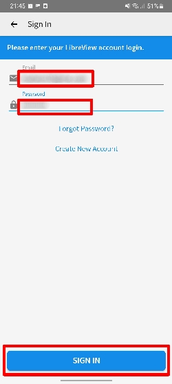

Anschliessend musst du die Nutzerbedingungen von Abbott akzeptieren. Die letzte ist dabei optional und kann auch abgelehnt werden.

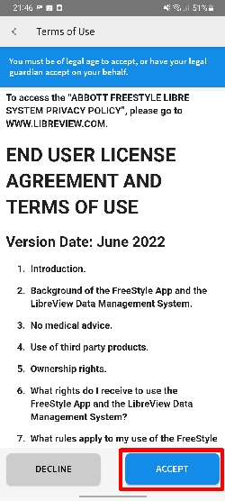 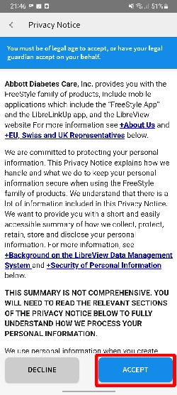 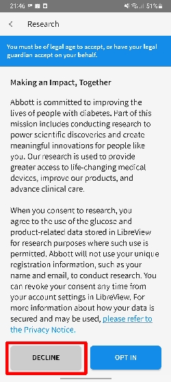

Stelle die App nun Schritt für Schritt nach deinen Bedürfnissen ein. Falls diese Meldung zur Deaktivierung der Akku-Optimierung auftaucht, dann klicke auf "Erlauben".

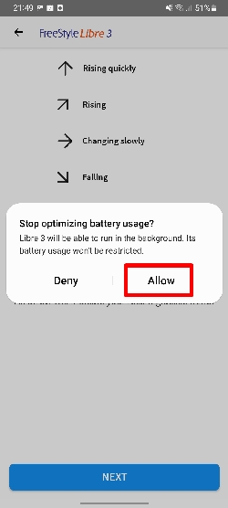

Nachdem du die Libre 3 App eingerichtet hast, darfst du bereits deinen ersten Sensor aktivieren. Scanne dazu wie gezeigt den Sensor und warte die 60 Minuten Aufwärmphase vom Sensor ab.

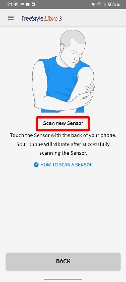

## Schritt 2: Libre 3 App beenden

Nachdem der Sensor erfolgreich gestartet ist und der erste Sensorwert sichtbar ist, kann es weitergehen. Öffne nun die Einstellungen und wähle den Menupunkt für "Apps".

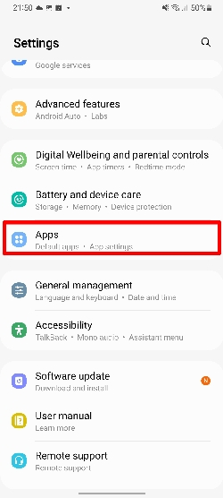

Anschliessend suchst du nach der Libre 3 App. Hast du diese gefunden, klickst du diese an.

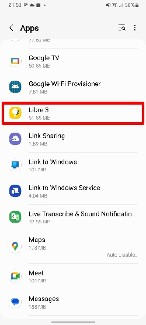

Nun klickst du auf "Stoppen" oder "Beenden erzwingen". Der genaue Button kann je nach Android Version variieren.

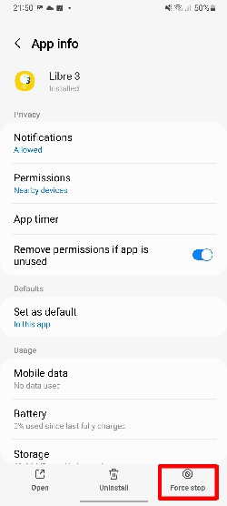

Sollte eine weitere Nachfrage kommen, kannst du diese mit "OK" bestätigen.

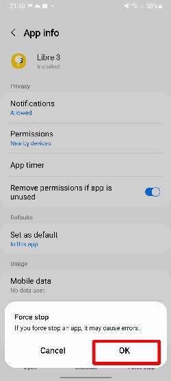

## Schritt 3: Juggluco installieren & einrichten

Lade nun die Juggluco App von [hier (Link)](https://github.com/maheini/FreeStyle-Libre-3-patch/raw/main/Juggluco-solution/versions/latest/Juggluco.apk) oder [hier (Mirror)](http://jkaltes.byethost16.com/Juggluco/download.html?i=1) (Version 4.0.1 oder höher) herunter und installiere diese. Mit Hilfe dieser App kann der Blutzuckerwert direkt an Xdrip und AndroidAPS weitergeleitet werden. Dazu wird der aktive Sensor (welcher auf Libreview registriert ist) innerhalb Juggluco weiterverwendet. Dies erklärt auch, weshalb ein Libreview Konto zwingend notwendig ist.

Nachdem du Juggluco installiert hast, kann es sein das mehrere Meldungen auftauchen. Erlaube Juggluco, Geräte in der Nähe zu finden, lokalisieren und verbinden.

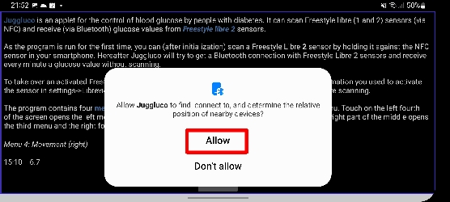

Auch hier kann eine Nachfrage zur Deaktivierung der Akku-Optimierung auftauchen. Klicke auf "Erlauben". Dies ist wichtig, damit die App im Hintergrund weiterläuft.

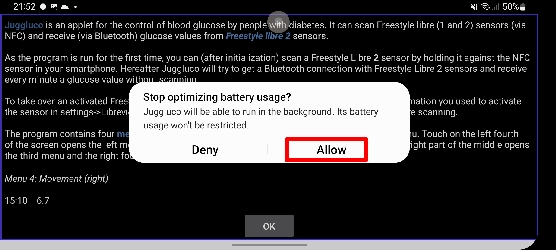

Klicke bei der Einführung von Juggluco auf "OK".

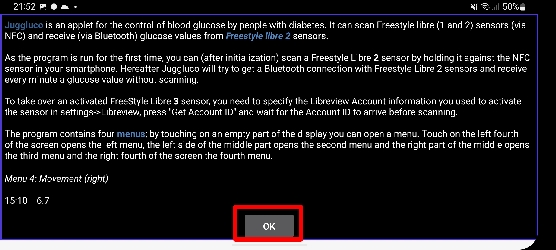

Nun siehst du den Juggluco Startbildschirm. Klicke hier in der linken oberen Hälfte ins leere. Die ungefähre Position siehst du hier.

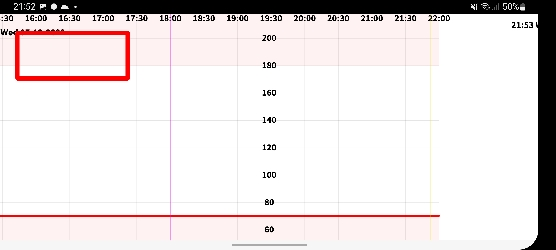

Es öffnet sich ein Menü. Hier kannst du "Settings" auswählen.

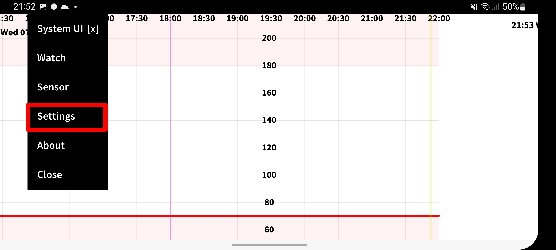

Anschliessend öffnet sich diese Seite. In der Auswahl "1." hast du die zwei Möglichkeiten:

1. "Send to xDrip" -> Mit dieser Einstellung werden die Blutzuckerwerte an xDrip weitergeleitet. Dazu muss als Empfänger "Libre2 patched" oder "Libre 2 (patched App)" auswählen.
2. "xDrip broadcast" -> Hiermit werden die minütlichen Blutzuckerwerte direkt an AndroidAPS weitergeleitet. Die Blutzuckerquelle muss dazu auf "xDrip+" eingestellt sein innerhalb AndroidAPS.

Um den Sensor zu starten, wählst du in der Auswahl "2." den Kontrollkasten "Libreview".

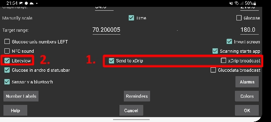

Im nächsten Fenster musst du deine Anmeldedaten für Libreview eingeben. Es muss sich um das Konto handeln, mit welchem der Sensor aktiviert wurde. Klicke danach auf "Get Account ID".

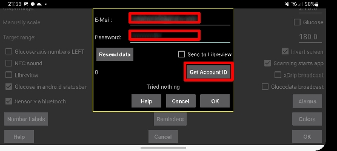

Falls alles geklappt hat, sollte nun eine mehrstellige Nummer unter dem "Resend data" Button ersichtlich sein. Dieser Vorgang kann etwas dauern - sollte die Nummer dennoch nicht erscheinen, so prüfe deine Internetverbindung und versuche die vorherigen Schritte nochmals.

**Hinweis:** Falls die Blutzuckerwerte auf Libreview hochgeladen werden sollen, kann der Kontrollkasten "Send to Libreview" aktiviert werden.

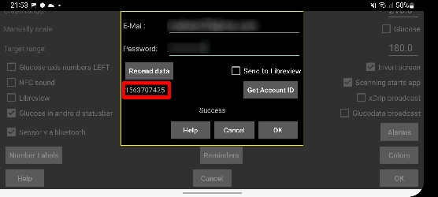

Nun ist es Zeit den Sensor erneut zu starten! Gehe auf den Juggluco Startbildschirm zurück und scanne deinen bereits aktivierten Sensor. Der Sensor wird gestartet und beginnt unter Umständen erneut eine 60 minütige Aufwärmphase. Nach den 60 Minuten sollten die Werte auf dem Juggluco Startbildschirm ersichtlich werden.

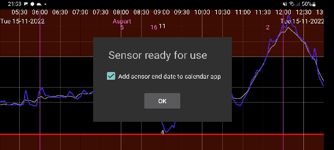

Fertig, das wars! Sollten die Werte nicht ersichtlich sein, dann findest du mehr Infos im Abschnitt "Erfahrungen und Fehlerbehebung".

## Schritt 4 (optional): xDrip einrichten

Die Blutzuckerwerte werden von der xDrip+ App auf dem Smartphone empfangen.

- Falls noch nicht eingerichtet, lade die xDrip+ App herunter und installiere einen der neuesten Nightly Builds von [hier](https://github.com/NightscoutFoundation/xDrip/releases).
- In xDrip+ wähle "Libre2 patched" oder "Libre2 (patched App)" als Datenquelle
- Batterieoptimierung deaktivieren und Hintergrundaktivität für die xDrip+ App zulassen
- Falls nötig, gib unter Less Common Settings->Extra Logging Settings->Extra tags for logging "BgReading:d,xdrip libre_receiver:v" ein. Dadurch werden zusätzliche Fehlermeldungen für die Fehlersuche protokolliert.
- Geh in xDrip+ auf Einstellungen -> Interapp-Kompatibilität -> Daten lokal übertragen und wähle EIN.
- Geh in xDrip+ zu Einstellungen -> Interapp-Kompatibilität -> Behandlungen akzeptieren und wähle AUS.
- Damit AAPS Blutzuckerwerte (ab Version 2.5.x) von xDrip+ empfangen kann, aktiviere bitte Einstellungen -> Interapp Einstellungen -> Empfänger identifizieren "info.nightscout.androidaps".
- Wenn du AndroidAPS zur Kalibrierung verwenden möchten, geh in xDrip+ zu Einstellungen -> Interapp-Kompatibilität -> Kalibrierungen akzeptieren und wähle EIN. Am besten prüfst du auch die Optionen unter Einstellungen -> Weniger allgemeine Einstellungen -> Erweiterte Kalibrierungseinstellungen überprüfen.

## Schritt 5 (optional): Sensor in xDrip starten

Starte den Sensor in xDrip+ mit „Sensor starten“ und „nicht heute“. Es ist nicht notwendig, das Smartphone an den Sensor zu halten. Tatsächlich wird „Sensor starten“ den Libre 3-Sensor nicht physisch starten oder mit ihm interagieren. Dies dient lediglich dazu, xDrip+ zu signalisieren, dass ein neuer Sensor Blutzuckerwerte liefert. Gib, falls vorhanden, zwei blutige Messwerte für die Erstkalibrierung ein. Jetzt sollten die Blutzuckerwerte alle 5 Minuten in xDrip+ angezeigt werden. Verpasste Werte, z. B. weil du zu weit von deinem Telefon entfernt warst, werden nicht nachgefüllt.

Warte mindestens 15-20 Minuten, wenn keine Daten empfangen werden.

Nach einem Sensorwechsel wird xDrip+ den neuen Sensor automatisch erkennen und alle Kalibrierungsdaten löschen. Du kannst deine blutig gemessenen Werte nach der Aktivierung überprüfen und eine neue Erstkalibrierung vornehmen.

## Schritt 6 (nur für Looper): AndroidAPS konfigurieren

- In AndroidAPS gehe zu Config Builder -> BG Source und wählen "xDrip+".
- Wenn AndroidAPS keine Werte empfängt, wenn sich das Telefon im Flugmodus befindet, verwende "Identify receiver".

## Von Juggluco zurück auf die Libre App wechseln

Es ist möglich, von Juggluco zurück zur Libre 3-App als Empfänger zu wechseln. Folgende Schritte sind notwendig:

1. Libre 3 App neu installieren (Oder Daten löschen in den Einstellungen)
2. Libre 3 App einrichten mit dem Libreview Konto, mit welchem der Sensor aktiviert wurde.
3. Stoppe die Juggluco App in den Einstellungen, ähnlich wie die Libre 3 App in der Anleitung.
4. Klicke im Libre 3 Menu auf "Sensor starten", wähle "Ja", "Weiter" und Scanne deinen Sensor.
5. Anschliessend sollte die 60 minütige Aufwärmphase beginnen. Diese ist nach jedem Wechsel notwendig und kann nicht übersprungen werden.

## Erfahrungen und Fehlerbehebung

### Notwendige Einstellungen für einen erfolgreichen Sensorstart

- NFC aktiviert / BT aktiviert
- Speicher- und Standortberechtigung aktiviert
- Ortungsdienst aktiviert
- automatische Zeit- und Zeitzoneneinstellung

Bitte beachte, dass der Ortungsdienst eine zentrale Einstellung ist. Es handelt sich nicht um die Standortberechtigung der App, die ebenfalls eingestellt werden muss!

### Fehlerbehebung Libre3 keine Messwerte

- Der Android-Ortungsdienst wird nicht erlaubt - bitte aktiviere ihn in den Systemeinstellungen
- automatische Uhrzeit und Zeitzone nicht eingestellt - bitte ändere die Einstellungen entsprechend
- Bluetooth ist ausgeschaltet - bitte einschalten
- Vergewissere dich, dass der Libre 3 Sensor mit keinem anderen Gerät verbunden ist.

### Fehlerbehebung Juggluco keine Messwerte

- Prüfe ob die Libre 3 App gestoppt ist.
- Scanne den Libre 3 Sensor erneut innerhalb der Juggluco App
- Vergewissere dich, dass der Sensor mit dem aktuellen Libreview Konto aktiviert wurde
- Prüfe ob eine Sensornummer in Juggluco ersichtlich ist
- Üblichweise wird der Sensor innerhalb von 3 Minuten mit dem Smartphone verbunden, kann aber auch länger dauern.
- Kann die Bluetooth Verbindung nicht hergestellt werden, dann versuche einen Neustart vom Smartphone.
- Vergewissere dich, dass der Libre 3 Sensor mit keinem anderen Gerät verbunden ist.

### Fehlerbehebung Blutzuckerwerte werden nicht auf Libreview hochgeladen

- Prüfe deine Internetverbindung
- Vergewissere dich, dass Juggluco Blutzuckerwerte empfängt
- Stelle sicher, dass der Kontrollkasten "Send to Libreview" aktiviert ist innerhalb Juggluco->Einstellungen->Libreview

### Weitere Hilfe

Originalanleitung: [jkaltes-Website](http://jkaltes.byethost16.com/Juggluco/libre3/)

Zusätzliches Github-Repo: [Github-Link](https://github.com/maheini/FreeStyle-Libre-3-patch)
