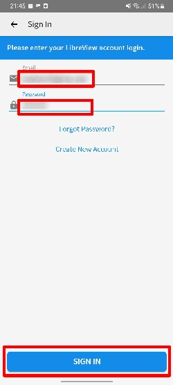
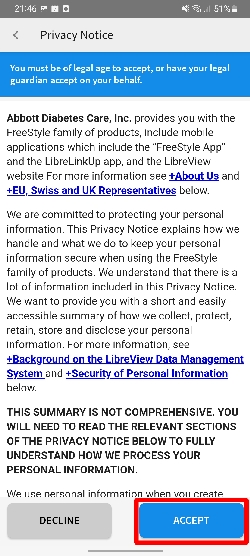
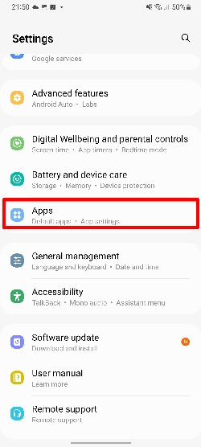
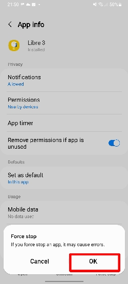
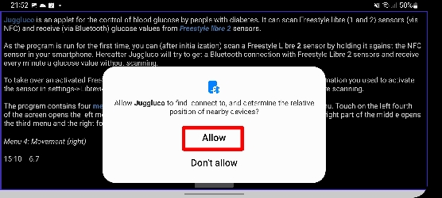
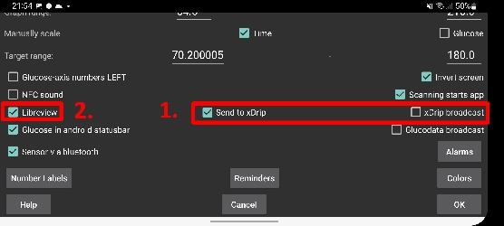
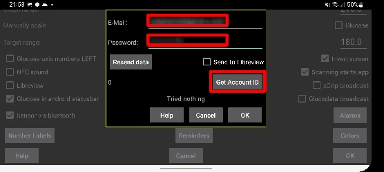
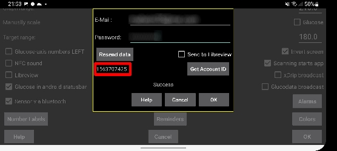
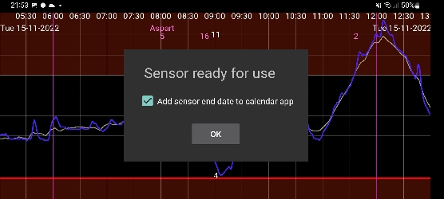

# Freestyle Libre 3 instructions

## Information

The Freestyle Libre 3 system can automatically report dangerous blood glucose levels. The Libre3 sensor sends the current blood glucose value to a receiver (reader or smartphone) every minute. The receiver triggers an alarm if necessary. With the help of the Juggluco app, the sensor can be taken over after the start and connected to Xdrip+, AndroidAPS or Libreview. In this way, the blood sugar values can be transmitted directly. It is even possible to receive historical data from the sensor's memory (two hours of minutely glucose and two weeks of once per 5 minute historical data) to be sent to Juggluco.

The sensor can be calibrated in the range of -40 mg/dl to +20 mg/dl (-2.2 mmol/l to +1.1 mmol/l) to compensate for differences between the bloody reading and the sensor readings.

### Current restrictions

- This solution currently does not work with the US variant of Libre3
- If you have a rooted system, you have to hide it. You can find instructions here: [Link](https://www.reddit.com/r/Freestylelibre/comments/s22vlr/comment/hw2p4th/?utm_source=share\&utm_medium=web2x\&context=3).
   (There are several apps to find out if the smartphone is rooted, one of them is e.g. [root-checker.org](https://root-checker.org/))
- The Juggluco app only supports English, Dutch and Italian languages.

## Step 1: Download and set up the Libre3 app

Install the Libre 3 app from the Playstore and open it. On the home screen, click Sign In. Registration with your Libreview account is mandatory - if you don't have one yet, you can create one.

 

You must then accept Abbott's Terms of Service. The last one is optional and can also be rejected.

  

Adjust the app step by step according to your needs. If you see this message about disabling battery optimization, tap "Allow".

After setting up the Libre 3 app, you can already activate your first sensor. To do this, scan the sensor as shown and wait for the sensor to warm up within the next 60 minutes.

## Step 2: Stop Libre 3 app

After the sensor has started successfully and the first sensor reading is visible, you can continue. Now open the settings and select the menu option for "Apps".

You then search for the Libre 3 app. Once you have found it, tap on it.

Now tap "Stop" or "Force stop". The exact button may vary depending on the Android version.

If there is another request, you can confirm it with "OK".

## Schritt 3: Juggluco installieren & einrichten

Installiere nun die [Juggluco App](https://play.google.com/store/apps/details?id=tk.glucodata) aus dem Playstore (Version 4.0.1 oder höher). Mit hilfe dieser App kann der Blutzuckerwert direkt an Xdrip und AndroidAPS weitergeleitet werden. Dazu wird der aktive Sensor (welcher auf Libreview registriert ist) innerhalb Juggluco weiterverwendet. Dies erklärt auch, weshalb ein Libreview Konto zwingend notwendig ist.

Nachdem die Juggluco installiert hast, kann es sein das mehrere Meldungen auftauchen. Erlaube Juggluco, Geräte in der nähe zu finden, lokalisieren und verbinden.

Auch hier kann eine Nachfrage zur Deaktivierung der Akku-optimierung auftauchen. Klicke auf "Erlauben". Dies ist wichtig, damit die App im Hintergrund weiterläuft.

Klicke bei der Einführung von Juggluco auf "OK".

Nun siehst du den Juggluco Startbildschirm. Klicke hier in der linken oberen Hälfte ins leere. Die ungefähre Position siehst du hier.

Es öffnet sich ein Menu. Hier kannst du "Settings" auswählen.

Anschliessend öffnet sich diese Seite. In der Auswahl "1." hast du die zwei Möglichkeiten:

1. "Send to xDrip" -> Mit dieser Einstellung werden die Blutzuckerwerte an xDrip weitergeleitet. Dazu muss als Empfänger "Libre2 patched" oder "Libre 2 (patched App)" auswählen.
2. "xDrip broadcast" -> Hiermit werden die minütlichen Blutzuckerwerte direkt an AndroidAPS weitergeleitet. Die Blutzuckerquelle muss dazu auf "xDrip+" eingestellt sein innerhalb AndroidAPS.

Um den Sensor zu starten, wählst du in der Auswahl "2." den Kontrollkasten "Libreview".

Im nächsten Fenster musst du deine Anmeldedaten für Libreview eingeben. Es muss sich um das Konto handeln, mit welchem der Sensor aktiviert wurde. Klicke danach auf "Get Account ID".

Falls alles geklappt hat, sollte nun eine mehrstellige Nummer unter dem "Resend data" Button ersichtlich sein. Dieser Vorgang kann etwas dauern - sollte die Nummer dennoch nicht erscheinen, so prüfe deine Internetverbindung und versuch die vorherigen Schritte nochmals.

**Hinweis:** Falls die Blutzuckerwerte auf Libreview hochgeladen werden sollen, kann der Kontrollkasten "Send to Libreview" aktiviert werden.

Nun ist es Zeit den Sensor erneut zu starten! Gehe auf den Juggluco Startbildschirm zurück und Scanne deinen bereits aktivierten Sensor. Der Sensor wird gestartet und beginnt unter Umständen erneut eine 60 minütige Aufwärmphase. Nach den 60 Minuten sollten die Werte auf dem Juggluco Startbildschirm ersichtlich werden.

Fertig, das wars! Sollten die Werte nicht ersichtlich sein, dann findest du mehr Infos im Abschnitt "Erfahrungen und Fehlerbehebung" nach.

## Schritt 4 (optional): xDrip einrichten

Die Blutzuckerwerte werden von der xDrip+ App auf dem Smartphone empfangen.

- Falls noch nicht eingerichtet, lade die xDrip+ App herunter und installiere einen der neuesten Nightly Builds von [hier](https://github.com/NightscoutFoundation/xDrip/releases).
- In xDrip+ wähle "Libre2 patched" oder "Libre2 (patched App)" als Datenquelle
- Batterieoptimierung deaktivieren und Hintergrundaktivität für die xDrip+ App zulassen
- Falls nötig, gib unter Less Common Settings->Extra Logging Settings->Extra tags for logging "BgReading:d,xdrip libre_receiver:v" ein. Dadurch werden zusätzliche Fehlermeldungen für die Fehlersuche protokolliert.
- Geh in xDrip+ auf Einstellungen -> Interapp-Kompatibilität -> Daten lokal übertragen und wähle EIN.
- Geh in xDrip+ zu Einstellungen -> Interapp-Kompatibilität -> Behandlungen akzeptieren und wähle AUS.
- Damit AAPS Blutzuckerwerte (ab Version 2.5.x) von xDrip+ empfangen kann, aktiviere bitte Einstellungen -> Interapp Einstellungen -> Empfänger identifizieren "info.nightscout.androidaps".
- Wenn du AndroidAPS zur Kalibrierung verwenden möchten, geh in xDrip+ zu Einstellungen -> Interapp-Kompatibilität -> Kalibrierungen akzeptieren und wähle EIN. Am besten prüfst du auch die Optionen unter Einstellungen -> Weniger allgemeine Einstellungen -> Erweiterte Kalibrierungseinstellungen überprüfen.

## Schritt 5 (optional): Sensor in xDrip starten

Starte den Sensor in xDrip+ mit „Sensor starten“ und „nicht heute“. Es ist nicht notwendig, das Smartphone an den Sensor zu halten. Tatsächlich wird „Sensor starten“ den Libre 3-Sensor nicht physisch starten oder mit ihm interagieren. Dies dient lediglich dazu, xDrip+ zu signalisieren, dass ein neuer Sensor Blutzuckerwerte liefert. Gib, falls vorhanden, zwei blutige Messwerte für die Erstkalibrierung ein. Jetzt sollten die Blutzuckerwerte alle 5 Minuten in xDrip+ angezeigt werden. Verpasste Werte, z. B. weil du zu weit von deinem Telefon entfernt warst, werden nicht nachgefüllt.

Warte mindestens 15-20 Minuten, wenn keine Daten empfangen werden.

Nach einem Sensorwechsel wird xDrip+ den neuen Sensor automatisch erkennen und alle Kalibrierungsdaten löschen. Du kannst deine blutig gemessenen Werte nach der Aktivierung überprüfen und eine neue Erstkalibrierung vornehmen.

## Schritt 6 (nur für Looper): AndroidAPS konfigurieren

- In AndroidAPS gehe zu Config Builder -> BG Source und wählen "xDrip+".
- Wenn AndroidAPS keine Werte empfängt, wenn sich das Telefon im Flugmodus befindet, verwende "Identify receiver".

## Zurück zur originalen Libre 3 App wechseln

Es ist möglich, von Juggluco auf die oroginale Libre 3 App zurück zu wechseln. Folgende Schritte sind notwendig:

1. Libre 3 App neu installieren (Oder Daten löschen in den Einstellungen)
2. Libre 3 App einrichten mit dem Libreview Konto, mit welchem der Sensor aktiviert wurde.
3. Stoppe die Juggluco App in den Einstellungen, ähnlich wie die Libre 3 App in der Anleitung.
4. Klicke im Libre 3 Menu auf "Sensor starten", wähle "Ja", "Weiter" und Scanne deinen Sensor.
5. Anschliessend sollte die 60 minütige Aufwärmphase beginnen. Diese ist nach jedem Wechsel notwendig und kann nicht übersprungen werden.

## Erfahrungen und Fehlerbehebung

### Notwendige Einstellungen für einen erfolgreichen Sensorstart

- NFC aktiviert / BT aktiviert
- Speicher- und Standortberechtigung aktiviert
- Ortungsdienst aktiviert
- automatische Zeit- und Zeitzoneneinstellung

Bitte beachte, dass der Ortungsdienst eine zentrale Einstellung ist. Es handelt sich nicht um die Standortberechtigung der App, die ebenfalls eingestellt werden muss!

### Fehlerbehebung Libre3 keine Messwerte

- Der Android-Ortungsdienst wird nicht erlaubt - bitte aktiviere ihn in den Systemeinstellungen
- automatische Uhrzeit und Zeitzone nicht eingestellt - bitte ändere die Einstellungen entsprechend
- Bluetooth ist ausgeschaltet - bitte einschalten

### Fehlerbehebung Juggluco keine Messwerte

- Prüfe ob die Libre 3 App gestoppt ist.
- Scanne den Libre 3 Sensor erneut innerhalb der Juggluco App
- Vergewissere dich, dass der Sensor mit dem aktuellen Libreview Konto aktiviert wurde
- Prüfe ob eine Sensornummer in Juggluco ersichtlich ist
- Üblichweise wird der Sensor innerhalb von 3 Minuten mit dem Smartphone verbunden, kann aber auch länger dauern.
- Kann die Bluetooth Verbindung nicht hergestellt werden, dann versuch einen Neustart vom Smartphone.

### Fehlerbehebung Blutzuckerwerte werden nicht auf Libreview hochgeladen

- Prüfe deine Internetverbindung
- Vergewissere dich, dass Juggluco Blutzuckerwerte empfängt
- Stelle sicher, dass der Kontrollkasten "Send to Libreview" aktiviert ist innerhalb Juggluco->Einstellungen->Libreview

### Weitere Hilfe

Originalanleitung: [jkaltes-Website](http://jkaltes.byethost16.com/Juggluco/libre3/)

Zusätzliches Github-Repo: [Github-Link](https://github.com/maheini/FreeStyle-Libre-3-patch)
